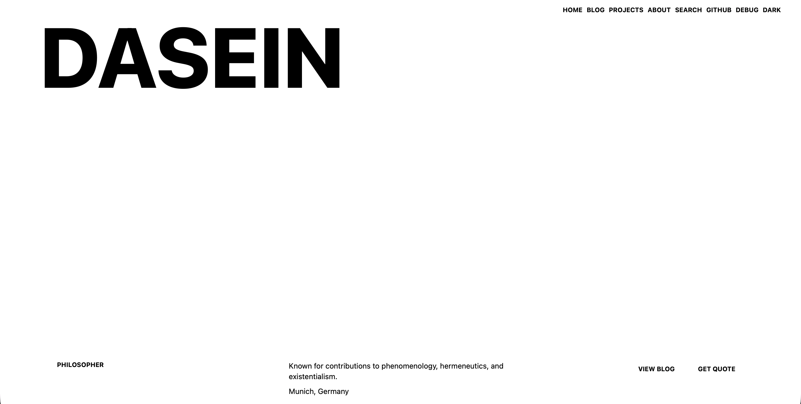

# Ashwin K — Personal Portfolio

My personal portfolio and blog, built with Astro.

The website showcases my projects, experiments, technical interests, and things I learn while working with AI, machine learning, data, and software development.

🌐 **Live Website:** https://ashwink45.github.io/



## About

I'm interested in building practical applications around AI, machine learning, data, and software.

This portfolio is a place where I document the projects I build, the technologies I experiment with, and the things I learn along the way.

## What's on the Website

- Personal introduction and About page
- Project showcase
- Technical blog
- Markdown/MDX-based blog posts
- Blog tags and categories
- Site-wide search using Pagefind
- Light and dark themes
- Responsive design for desktop and mobile
- RSS feed
- Sitemap
- SEO-friendly pages

## Tech Stack

- **Framework:** Astro
- **Styling:** Tailwind CSS
- **Language:** TypeScript / JavaScript
- **Content:** Markdown / MDX
- **Search:** Pagefind
- **Icons:** Astro Icon
- **Deployment:** GitHub Pages

## Getting Started

### Requirements

- Node.js
- npm

### Installation

Clone the repository:

```bash
git clone https://github.com/Ashwink45/Ashwink45.github.io.git
cd Ashwink45.github.io
