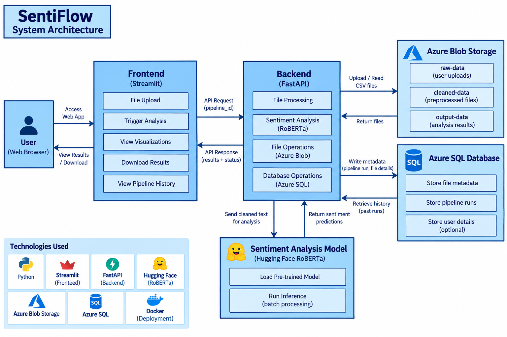
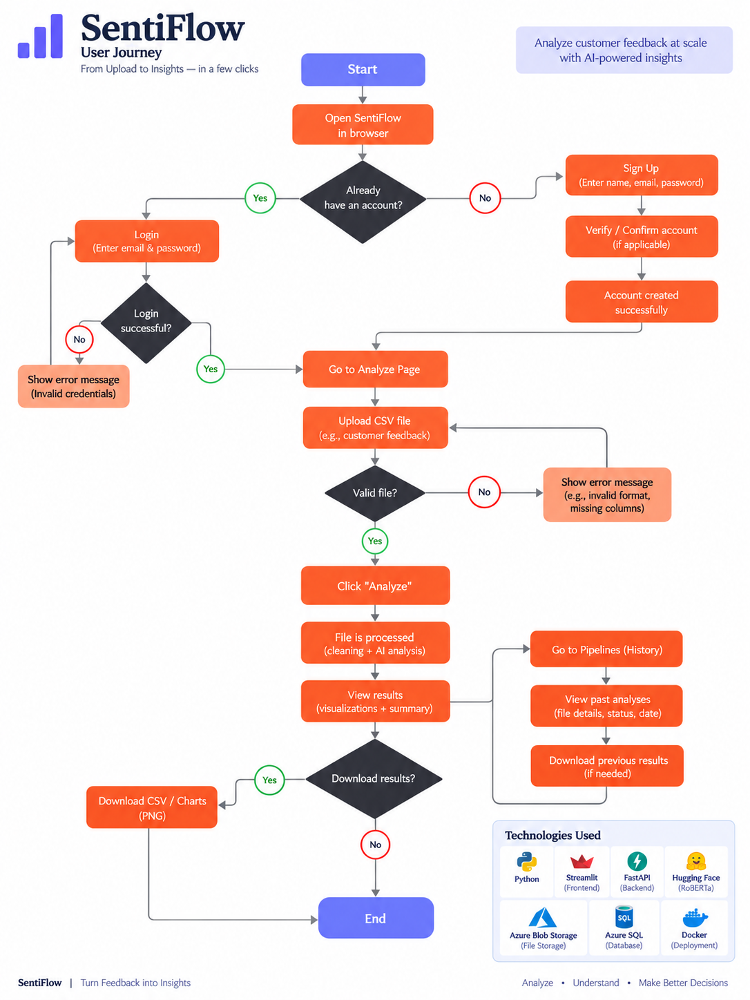

# Building SentiFlow: My Journey into Cloud-Integrated Sentiment Analysis

I have always enjoyed building projects that go beyond training a machine learning model. I wanted to understand how an ML model could become part of a practical application that users can interact with.

That curiosity led me to build **SentiFlow**, a web-based sentiment analysis platform that allows users to upload feedback datasets, generate sentiment predictions, and explore results through an interactive dashboard.

## The Problem I Wanted to Solve

Analyzing large amounts of customer feedback manually can be repetitive and time-consuming. My goal was to create a workflow where users could upload a CSV file and automatically obtain sentiment insights without having to write Python code themselves.

SentiFlow was designed around four main steps: uploading feedback, preprocessing the data, performing sentiment analysis, and presenting the results.

## Tech Stack & System Architecture

I built the application using Python, Streamlit, FastAPI, Polars, Hugging Face Transformers, Azure Blob Storage, Azure SQL, and Docker.

Streamlit handles the user interface, while FastAPI manages the sentiment analysis endpoint. Azure Blob Storage stores the raw, cleaned, and processed CSV files. Azure SQL stores file and pipeline metadata.



<figcaption>
  **Figure 1:** SentiFlow system architecture and interaction between the frontend, backend, ML model, and cloud services.
</figcaption>

## How the Data Flows Through the Application

The workflow begins when a user uploads a CSV file through the Streamlit interface. The application generates a unique pipeline ID and stores the original file in Azure Blob Storage.

The preprocessing function, `process_blob()`, downloads the file from the `raw-data` container, trims column names, selects available `Date` and `Feedback` columns, removes null feedback values, and uploads the cleaned dataset to `cleaned-data`.

The application then triggers the FastAPI `/analyze` endpoint using the pipeline ID.



<figcaption>
  **Figure 1:** SentiFlow system architecture and interaction between the frontend, backend, ML model, and cloud services.
</figcaption>

## The Code Solution

One of the important implementation decisions was loading the RoBERTa model when the FastAPI application starts rather than loading it for every request.

```python
classifier = pipeline(
    "sentiment-analysis",
    model="cardiffnlp/twitter-roberta-base-sentiment",
    device=-1
)
```

The `/analyze` endpoint downloads the cleaned CSV, extracts the feedback text, and performs inference in batches of 32.

```python
raw_results = classifier(
    texts,
    batch_size=32,
    truncation=True,
    max_length=512
)
```

I then map the model's labels to readable categories: Negative, Neutral, and Positive. The predictions are added to the dataframe and uploaded as a new CSV file in `output-data`.

## Challenges & Trade-offs

One of the challenges I encountered was integrating multiple services into a single workflow. The application depends on Azure Blob Storage for file operations and Azure SQL for metadata, which means configuration and connectivity are important parts of the deployment process.

I also chose CPU-based inference to support environments where a dedicated GPU is unavailable. Although this simplifies deployment, inference performance depends on the dataset size and available computing resources.

Another trade-off was keeping the analysis workflow synchronous. The frontend waits for the preprocessing and API request to complete, making the flow straightforward but potentially limiting the user experience for larger datasets.

## What I Learned

SentiFlow helped me understand that building an ML application involves much more than choosing a model. I gained practical experience in NLP inference, backend API development, cloud storage, database integration, and designing a user-facing workflow.

This project strengthened my interest in AI/ML engineering and building applications that turn machine learning into something useful.

## Conclusion

SentiFlow represents my effort to connect machine learning with real-world application development. From uploading a CSV to generating sentiment insights, I explored how different technologies can work together to create a complete product.

I look forward to improving the platform further with more advanced analytics, better processing workflows, and additional NLP capabilities.

