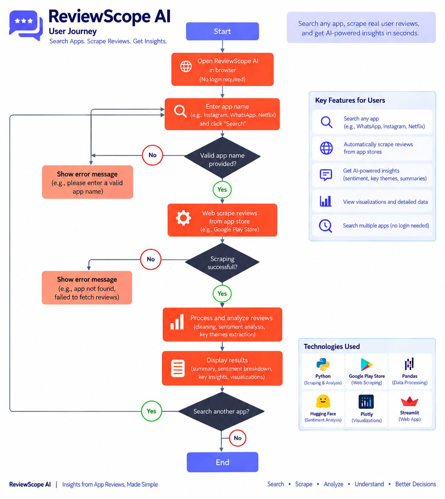

# Building ReviewScope AI: From Live App Reviews to Product Insights

I have always been interested in understanding how machine learning can be applied to data that changes continuously in the real world.

Instead of working with a static dataset, I wanted to build something where the user could enter an application, collect its latest reviews, analyze them automatically, and understand what users were actually saying.

That idea led me to build **ReviewScope AI**, an AI-powered review intelligence dashboard that collects Google Play Store reviews, performs sentiment analysis, and uses a large language model to identify recurring issues in negative feedback.

The goal was simple: **turn raw app reviews into useful product insights without requiring the user to manually collect or analyze the data.**

## The Problem I Wanted to Solve

App stores contain a huge amount of valuable customer feedback, but manually going through hundreds of reviews can be difficult and time-consuming.

A product team might want to answer questions such as:

- Are users generally satisfied with the application?
- How many recent reviews are negative?
- Which application versions are receiving the most complaints?
- When are negative reviews appearing most frequently?
- What are the most common problems users are reporting?

I wanted ReviewScope AI to provide these answers through a single dashboard.

The workflow was designed around a simple process:

**Search for an app → Scrape reviews → Process the data → Analyze sentiment → Generate AI insights → Visualize the results.**

## Tech Stack & System Architecture

I built the application using **Python, FastAPI, Google Play Scraper, Polars, Hugging Face Transformers, DistilBERT, Qwen 2.5, Chart.js, HTML/CSS/JavaScript, Bootstrap, and Docker**.

FastAPI acts as the backend API and exposes the `/analyze` endpoint. The frontend provides the dashboard where users can search for an application and view the generated insights.

Google Play Scraper is responsible for collecting the reviews, while Polars handles the data processing pipeline.

For machine learning, I used a DistilBERT sentiment classification model from Hugging Face. I then added a generative AI layer using **Qwen 2.5 7B Instruct** to summarize recurring problems found in negative reviews.

The application can also be containerized using Docker, making the entire system easier to deploy.



<figcaption>

**Figure 1:** ReviewScope AI architecture showing the interaction between the frontend, FastAPI backend, review scraper, NLP pipeline, and generative AI model.

</figcaption>

## How the Data Flows Through the Application

The workflow starts when a user enters an application name in the search box.

For example, instead of requiring the user to know the exact Google Play package ID, they can enter an application name such as `WhatsApp`.

The backend sends this input to the application search functionality provided by `google-play-scraper`.

If a valid application is found, ReviewScope retrieves its package ID and uses that ID to collect reviews from Google Play Store.

The scraper currently retrieves up to 100 reviews and requests the newest reviews first.

The raw review data contains information such as:

- Review text
- Star rating
- Review date
- Application version

The data is then passed into the processing pipeline.


### Adding Generative AI for Issue Analysis

Sentiment classification tells us whether a review is positive or negative, but it does not necessarily explain why users are unhappy.

That is where I added a second AI layer.

After sentiment analysis, ReviewScope extracts negative reviews and sends representative examples to **Qwen 2.5 7B Instruct** through Hugging Face.

The prompt asks the model to identify:

- Major recurring complaints
- The most critical issue
- Severity
- Relevant issue keywords
- A concise summary of the negative feedback

The model is instructed to return structured JSON.

```

negative_reviews = [
    r["review"]
    for r in reviews
    if r.get("model_sentiment") == "NEGATIVE"
    and r.get("review")
    and len(r["review"].split()) > 5
]

sample_reviews = negative_reviews[:5]

result = client.chat_completion(
    model="Qwen/Qwen2.5-7B-Instruct",
    messages=[
        {
            "role": "user",
            "content": prompt
        }
    ],
    max_tokens=400
)

ai_text = result.choices[0].message.content
ai_data = json.loads(ai_text)

```

## Challenges & Trade-offs

One of the main challenges was finding a reliable scraper that could consistently retrieve useful reviews from the Google Play Store.

Another challenge was integrating a free generative AI service with enough token capacity for the application. I also had to balance the number of reviews sent to the LLM to keep the analysis efficient while still providing useful insights.

## What I Learned

ReviewScope helped me gain practical experience in web scraping, data processing, sentiment analysis, LLM integration, API development, and data visualization.

I also learned that building an AI application involves more than selecting a model. The surrounding pipeline, data quality, API limitations, and system design are equally important.

## Conclusion

ReviewScope AI was my attempt to turn raw application reviews into meaningful product insights using web scraping, NLP, and generative AI.

The project helped me understand how different AI and software components can work together to create a practical end-to-end application. I look forward to improving it further with larger datasets, better issue detection, and more advanced analytics.
